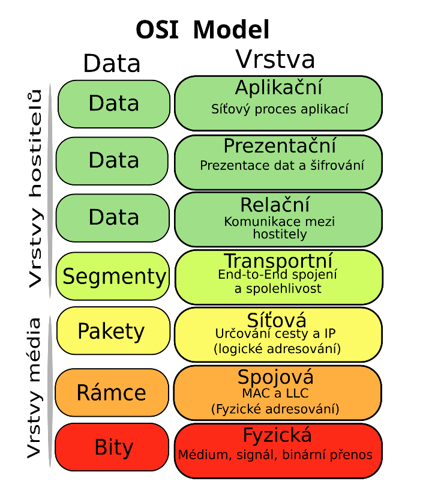

# Model ISO/OSI
Ref. model ISO/OSI - sítě

Referenční model ISO OSI (International Organization for Standardization) je určitý soubor
pravidel a norem které určují jak by různé části počítačových sítí měly spolupracovat, cílem je poskytnout
nějaký základ na kterém se dají stavět složitější normy pro propojení PC systemu, a také aby např.
zařízení od různých výrobců spolu mohly pracovat.

---
Model se dělí do sedmi vrstev, od nejnižší (až hardwarove) po nejvyšší a nejvíce abstraktní uroven
### Sedm vrstev:
1. [**Vrstva Fyzická** (Physical Layer)](#fyzická-vrstva)
1. [**Linková vrstva** (Data Link layer)](#linková-vrstva)
1. [**Síťová vrstva** (Network layer)](#síťová-vrstva)
1. [**Transportní vrstva** (Transfport layer)](#transportní-vrstva)
1. [**Relační Vrstva** (Session Layer)](#relační-vrstva)
1. [**Prezentační Vrstva** (Presentation layer))](#prezentační-vrstva)
1. [**Aplikační vrstva** (Application layer)](#aplikační-vrstva)

    </img>

## Fyzická vrstva
- Zabívá se převážně fyzikalnimi vlastnostmi přenosu dat, kabely konektory, signály
- Jak jsou samotné 0/1 přenášeny
- Neřeší a nezajištuje kontrolu dat/chyb.

---

## Linková vrstva
- Stará se o přenos "framů" mezi zařízeními v síti, adresováni zařízení, a detekci chyb v přenosu dat. (např CRC)
- dělí se na podvrstvy
    - **MAC** (Media Access Control): adresování zařízení (sítovych rozhrani) a přístup k medium.
    - **LLC** (Logical Link Control): stará se o spolehliví přenos dat a jak se různé protokoly chovají na siti.
- Např. jednoduchý switch dělá v linkové vrstvě.

---

## Síťová vrstva
- Převážně se stará o logické adresování sítě (IP adresy), směrování paketu mezi sitěmi, routing (směrování)
- Různé protokoly, např: IPV4, IPv4, ICMP
- Router např pracuje na síťové vrstvě.

---

## Transportní vrstva
- Stará se o přenos dat mezi uzly sítě s námi požadovanou kvalitou/spolehlivostí, záleží na protokolu
- Protokoly např:
    - **TCP** (Transfer Control Protocol): spojovaný, ověřuje přichod dat a je spolehlivý, kontroluje pořadí paketu a případné kopie
    - **UDP** (User Datagram Protocol): Rychlý, nespojovaný, ale bez záruky doručení dat.

    </img>

---

## Relační Vrstva
- Řídí relace (propojení) mezi aplikacemi, jejich navázání, správu, ukončení a synchronizaci
- Kdo komunikuje a jak dlouho.
- Synchronizační body při větším množství dat.

---

## Prezentační vrstva:
- Mnění přijatá a odeslaná data tak aby obě strany jim rozuměly, například se stará o
    - šifrování (SSL/TLS)
    - kompresy
    - kodování/formátování (ASCII/UTF8)

---

## Aplikační vrstva
- Nejvíc abstraktní vrstva a nejblíž uživateli, ruzne sitově služby jako např prohližeč nebo email client
- Různé protokoly
    - HTTP
    - HTTPS
    - FTP
    - SMTP
    - DNS
    - Telnet
    - atd...
- všechny ruzne služby sitove na vyšší urovni sem zapadají, ne jen např webove stranky

# Různé klíčové pojmy:
- **Zapouzdření** (Encapsulation) - jak data přecházení z vyšší vrstvy do nižší, každá vrstva přidá vlastní západí/zahlaví, na straně přijemce se děje opačný proces
- ** Modularita vrstev** - Vrstva z vyšších vrstvách používá služby z vrstvy pod ní a poskytuje služby vrstvě nad ní
- **Ref. vs skutečné modely" - model ISO/OSI je sice pěkný ale v praxi se někdy třeba používá TCP/IP model s méně vrstvami.