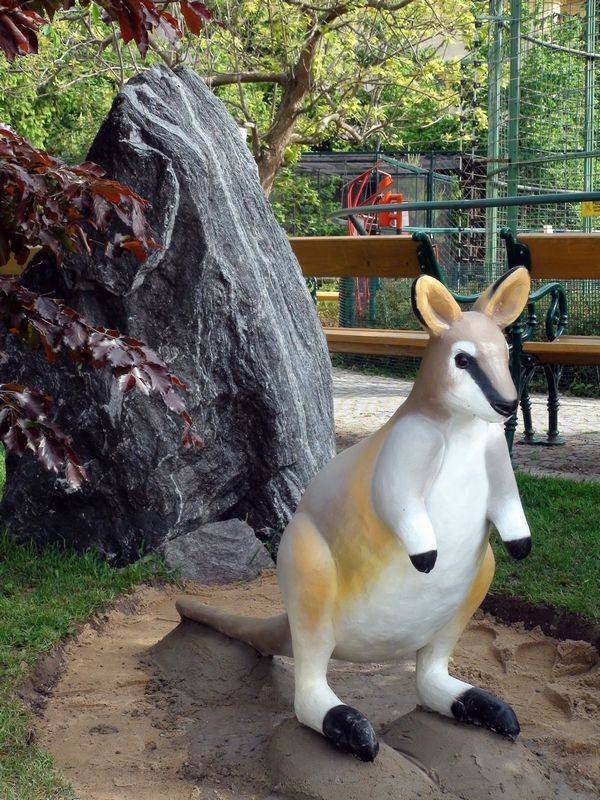

<h style="color: burlywood; font-size:3rem"><strong>Klokan Greyův</strong><h>

- původ: západ Australie

- jak se stal potřebným pro člověka: kvůli masu a kůži

- kde žil: obývali převážně lesy, travnaté oblasti a bažiny

- popis druhu: skoro vyhynulý druh, měl výraznou obličejovou masku, tmavé konce všech končetin a střídavé tmavé a světlejší pruhy přes záda

- proč daný druh člověk využíval: z důvodu potravi a materiálu, jeho maso se stalo součástí austrálské kuchyně, zatímco z jeho kůže se dělalo oblečení a další oděvní material

- jak ho člověk ovlivnil: změna krajiny kde žily

- **NAŠE** řešení problémů: sledovat změny v prostředí a chování živočichů

další řešení: skladba "Řezník - Autogenocida"

