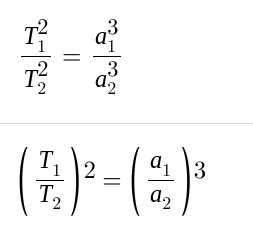

# Keplerovy zákony

1. KZ. - planety se pohybují po elipsách (perihélium a ajélium)
2. KZ. - plocha obsaná průvudičem planety je v průběhu času stejná
3. KZ. - Poměr druhých mocnin oběžných dob dvou planet se rovná poměru třetích mocnin hlávních poloos jejich trajektorii

# hodně štěstí xdd
---