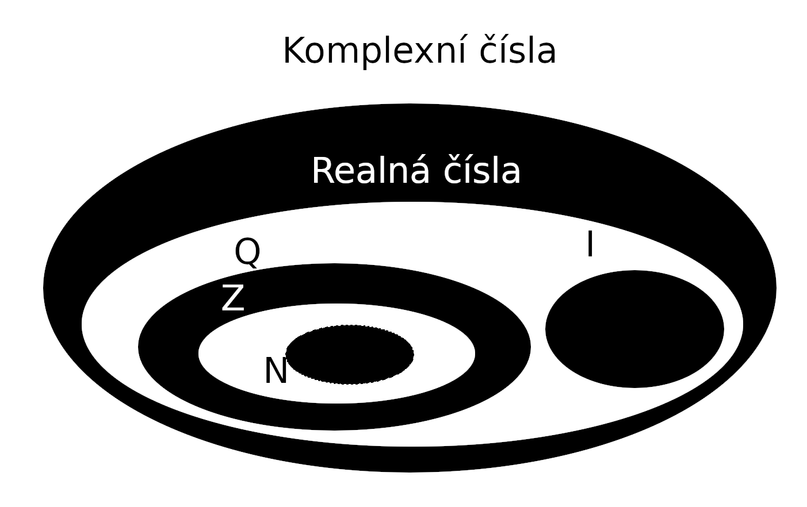
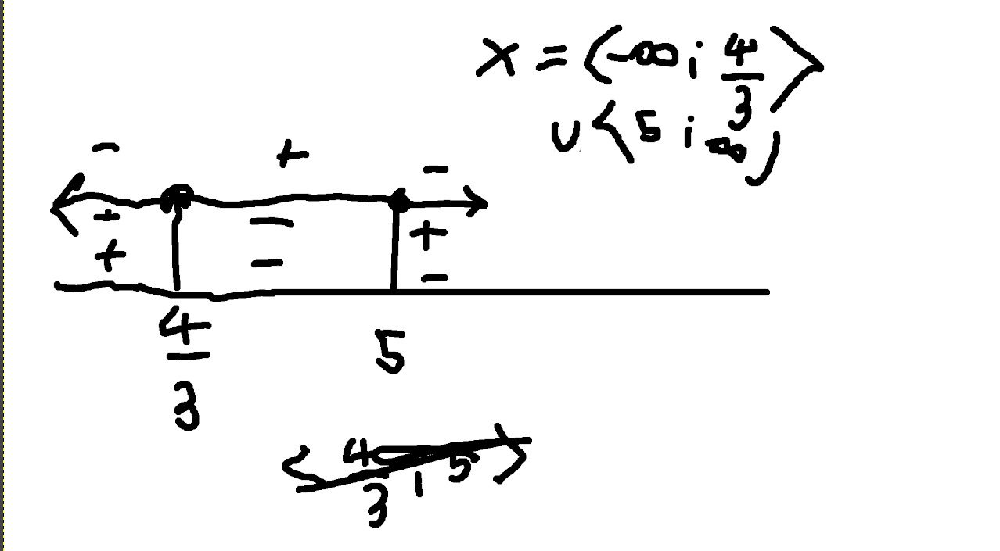
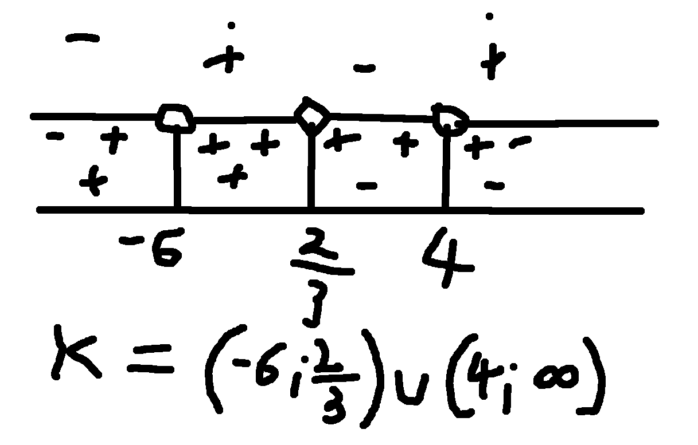
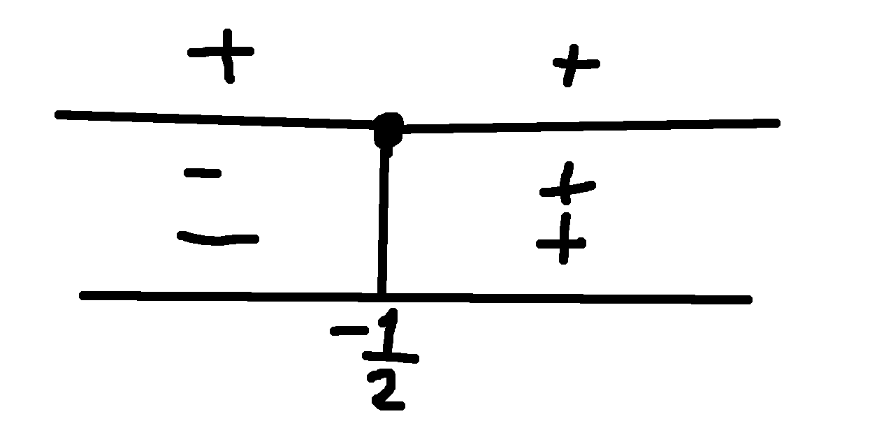
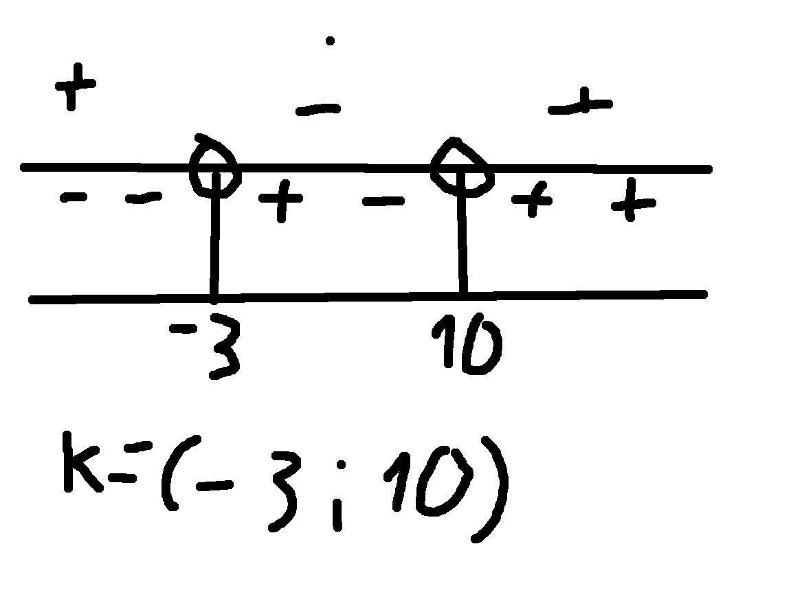

# Rovnice v součinovém tvaru
- Množiny
    - `N` -> množina všech **připozených čísel**
    - `Z` -> množina všech **celých čísel**
    - `Q` -> množina všech **racionálních čísel**
    - `I` -> množina všech **iracionálních čísel**
    - `R` -> množina všech **realných čísel**
    - `C` -> množina všech **komplexních čísel**

## Řeště u R
(x-5) * (4-3x) = 0

- pokuď se jedna ze závorek bude rovnat nule, výsledek bude nula,
řešíme kdy se obě závorky rovnají nule zvlášt, vsýsledek bude množina dvou čísel

---

(x-5) = 0

x1 = 5

---

(4-3x) = 0

- toto se dá řešit jako linearní rovnice

x2 = 4/3

4/3 = 1.3

---

x = {x1;x2}

x = {5;4/3}

## Příklad 2

x2 - 5x + 6

- řešení bez diskriminantu

(x + a)*(x + b) = 0

a + b == -5 (x)

a * b == 6

---

(x - 2)*(x - 3) = 0

(-2) + (-3) = -5

(-2) * (-3) = 6

---
- řešení (x - 2)*(x - 3) = 0

x1 = 2
x3 = 3

x = {2;3}

### Nerovnice v součinovém tvaru (př. 3)
(x - 5) * (4 - 3x) <= 0

## Příklad 4

(x + 6) * (4 - x) * (-3x + 2) > 0

nb1 = -6

nb2 = 4

nb3 = 2/3

## Příklad 5.
(4x + 2)^2 >= 0

- rozložení mocniny

(4x + 2) * (4x + 2) >= 0

nb1 = -0.5

nb2 = -0.5

nb = -0.5

- pow(2) se chová jako "absolutní" hodnota

K = R

## Příklad 6
(x + 3)*(2x - 20) < 0

nb1 = -3

nb2 = 10

nb = [-3;10]

