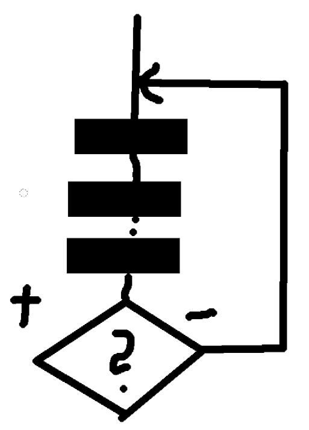

# Cykly
1. s podmínkou na konci
1. s podmínkou na začátku
1. se známím počtem průchodů

### ad a.
- minimálně jeden průchod



#### syntax:
```pascal
repeat
    prikaz1;
    |
    prikazN;
until podminka;
```

### ad b.
- možno nula průchodů
```pascal
while podminka do begin
    prikaz1;
    |
    prikazN;
end;
```


### ad c.
- počet průchodů `n`
```pascal
for i:=1 to n do begin
    prikaz1;
    |
    prikazN;
end;
```


## příklady
```pascal
program thingy_1;

var i:integer;

begin
    readln(i);
    while ((i < 1) or (i > 10)) do begin
        readln(i);
        writeln('vstup neni v ramci 1-10');
    end;

    writeln();
    writeln('vstup: ',i);
end.
```

```pascal
program thingy_2;

var i:integer;

begin
    repeat
        readln(i);
    until ((i >= 1) and (i <= 10));

    writeln();
    writeln('vstup: ',i);
end.
```